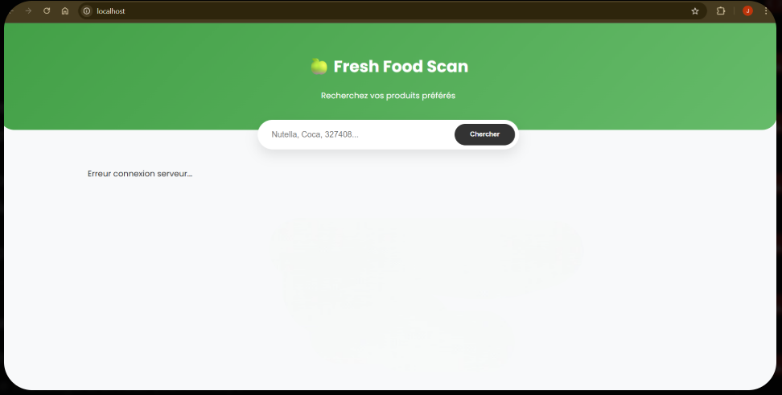
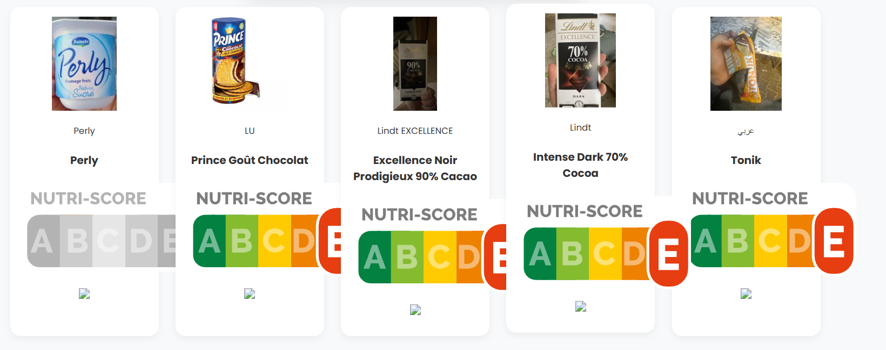
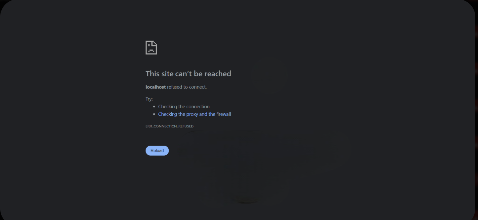
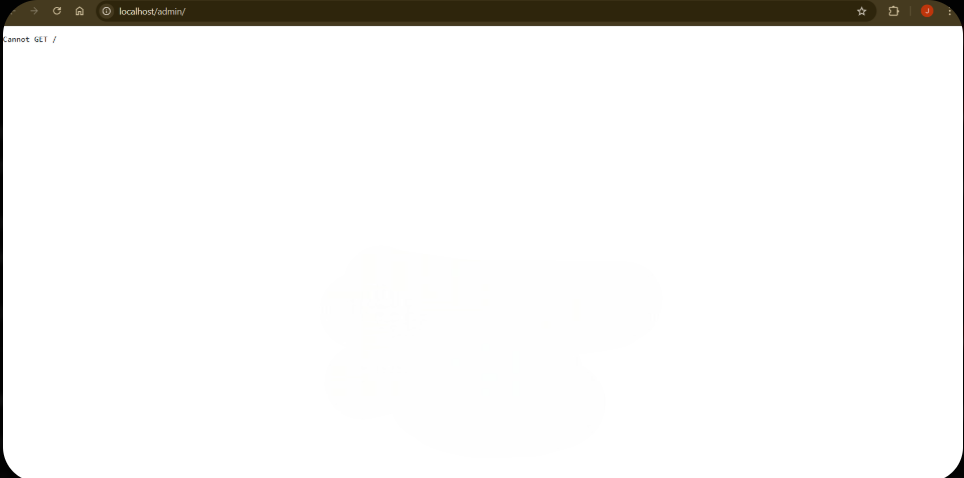

# Open Food Facts

**MEMBRES DU GROUPE :**
> - ATALLAH Joud
> - HDILOU Walid


---


## 1. Présentation du Projet
Ce projet est une application Fullstack permettant de rechercher des produits alimentaires via l'API Open Food Facts. L'utilisateur peut taper le nom d'un produit et l'application affiche ensuite les détails du produit (image, marque, nutri-score ) et sauvegarde automatiquement l'historique des recherches dans une base de données. 

*

---


## 2. Objectif du projet 

Créer une infrastructure conteneurisée grâce à Docker afin d’héberger et déployer une application web, avec une séparation claire des services (web, API, base de données, administration) grâce à 4 conteneur, un point d’entrée unique via reverse proxy et une exposition HTTPS via tunnel Cloudflare.

**Fonctionnalités principales :**
* Page d'acceuil : produits populaires aléatoires par catégories
* Recherche et affichage intelligente : Texte/Code-Barre + fiche détail produit
* Sauvegarde automatique d’un historique en base MongoDB


**Screenshot de l'application déployée** : 

---

## 3. Architecture Technique
* 2 services web : Frontend + Backend
* Un service de données : MongoDB
* Un service admin : mongo-express
* Reverse proxy : Caddy
* Accès Internet via tunnel : Cloudflared

### Schéma d'infrastructure
*Ce schéma est généré dynamiquement à partir du fichier `architecture.puml` présent dans ce dépôt.*


### Description des services
| Service | Image Docker | Rôle | Port Interne |
| :--- | :--- | :--- | :--- |
| **Frontend** | `./frontend` | Interface utilisateur (HTML/CSS/JS) | 80 |
| **Backend** | `./backend` | API OpenFoodFacts + Historique | 3000 |
| **Base de données mongo** | `mongo:6.0` | Base de données (historique) | 27017 |
| **Administrateur** | `mongo-express:latest` | Interface admin (gestion MongoDB) | 8081 |
| **Caddy** | `caddy:latest` | Reverse proxy (point d’entrée unique) | 80 |
| **Cloudflared** | `cloudflare/cloudflared` | Tunnel HTTPS public |  |

## 3. Guide d'installation

Pour lancer le projet localement :

1.  Cloner le dépôt :
    ```bash
    git clone [https://github.com/Joud04/API_open_food.git](https://github.com/Joud04/API_open_food.git)
    cd votre-repo
    ```

2.  Lancer la stack :
    ```bash
    docker compose up -d
    ```
    
3.  Obtenir l'URL publique :
    ```bash
    docker logs cloudflared
    ```

4.  Accéder aux services :
    * Web : Copier l'url du site 
    * Admin : Cliquer sur le bouton admin en haut de la page :
              Id : admin / Password : pass 

---

## 4. Méthodologie & Transparence IA

### Organisation

Pour ce projet, nous avons privilégié un travail mutuel plutôt qu'une division stricte des tâches. Nous avons travaillé sur l'ensemble du projet pour que chacun puisse faire un peu de tout: Frontend, Backend, BDD...

Au démarrage, l'un de nous s'est chargé de créer la base du site (Frontend/Backend) pendant que l'autre préparait l'environnement Docker. Ensuite, nous avons échangé les rôles : celui qui avait géré l'infrastructure a repris le code pour moderniser le design, tandis que l'autre membre s'est occupé de finaliser les fonctionnalités et l'intégration. Cette rotation nous a permis de relire le travail de l'autre et de maîtriser tous les deux 100% du projet.

---

### Utilisation de l'IA (Copilot, ChatGPT, Cursor...)
*Nous avons utilisé Gemini, principalement pour la création du Backend et du FrontEnd, ainsi que pour déboger les erreus liées à la base de données. *

* **Outils utilisés :**
    * Gemini  
* **Usage :**
    * *Génération et Aide lors de la réalisation du Frontend :* Nous avons utilisé Gemini pour ne pas perdre de temps sur le visuel de la page et ajouter des modifications sur le site
    * *Aide lors de la création du Backend :* L’IA nous a aidés à construire et structurer le backend en Node.js en proposant Axios pour appeler l’API OpenFoodFacts proprement
    * *Création de logs :* Nous avons utilisé Gemini pour ajouter des logs afin d'afficher un message d'erreur pour plusieurs problème rencontrées (Erreur 404, Erreur 502, Cannot GET...) 
    * *Graphique UML :* (Nous avons utilisé Gemini pour créer le fichier 'architecture.pml' afin d'afficher le graphique UML)

* **Apprentissage :** 

L’IA nous a surtout aidés à accélérer le développement en proposant une base de code fonctionnelle (routes Express, appels API OpenFoodFacts, connexion MongoDB, structure Docker).
Cependant, nous avons pris le temps de comprendre et vérifier chaque partie en testant le projet étape par étape.

* Ce que l’IA a fait :

proposer la structure du backend 
aider à consommer l’API OpenFoodFacts (Axios, champs FIELDS)
proposer la sauvegarde de l’historique en MongoDB (Mongoose)
aider à corriger des erreurs Docker / réseau (IPv4, DNS)

* Ce que nous avons compris et maîtrisé :

comment un frontend appelle un backend via des routes API (/api/search, /api/history)
comment enregistrer et récupérer des données avec MongoDB
comment les services Docker communiquent entre eux (nom de service mongo, reverse proxy Caddy, tunnel Cloudflare)
comment diagnostiquer une erreur (logs, test des routes, redémarrage des conteneurs)

Au final, l’IA nous a servi de support, mais nous avons assuré la compréhension, le débogage et l’intégration finale pour obtenir une infrastructure complète et fonctionnelle.

---

## 5. Difficultés rencontrées & Solutions

* **Problème 1 :** Actualisation lente de l'affichage des produits au sein de l'API OpenFoodFacts
  
  *Solution : On a diminué le nombre de produits présents dans une page de 24 à 20.*


* **Problème 2 :** Erreur de connexion à l'API due à une exécution trop rapide du Backend

   
  
  *Solution : Ajout d'un timeout de 30 secondes dans le code Node.js.*


* **Problème 3 :** Problème de dimensions d'image sur le site (la plupart des images étaient très grandes)

    
  
  *Solution : Verrouillage de la taille des images avec des règles CSS strictes.* 

* **Problème 4 :** Problème lors du redémarrage de Docker : l'historique des produits disparaissait
  
  *Solution : Configuration d'un dossier `data/` pour stocker les données de MongoDB (volume persistant).*

* **Problème 5 :** Erreurs dans le fichier javascript 
  
  *Solution : Relecture et communication entre membres du groupe.*

 
 
 
